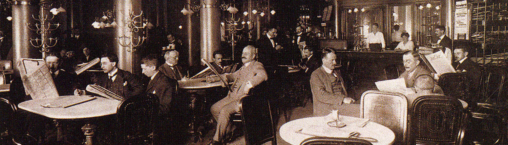

# Heading 1

## Heading 2

### Heading 3

The Café Central is indeed a coffeehouse unlike any other coffeehouse. It is instead a worldview and one, to be sure, whose innermost essence is not to observe the world at all.[^1]

#### Heading 4

If all the anecdotes related about this coffeehouse were ground up, put in a distillation chamber and gassified, a heavy, iridescent gas, faintly smelling of ammonia, would develop: the so-called air of the Cafe' Central.

##### Heading 5

The Café Central lies on the Viennese latitude at the meridian of loneliness. Its inhabitants are, for the most part, people whose hatred of their fellow human beings is as fierce as their longing for people, who want to be alone but need companionship for it. Their inner world requires a layer of the outer world as delimiting material; their quivering solo voices cannot do without the support of the chorus. They are unclear natures, rather lost without the certainties which the feeling gives that they are a little part of a whole (to whose tone and color they contribute).

###### Heading 6

The Centralist is a person to whom family, profession, and political party do not give this feeling. Helpfully, the coffeehouse steps in as an ersatz totality, inviting immersion and dissolution.

> It is thus understandable that above all women, who can really never be alone and need at least one other person along with them, have a weakness for the Cafe Central. It is a place for people who know how to abandon and be abandoned for the sake of their fate, but who do not have the nerve to live up to this fate.

## Lists

### Ordered List

1. The Cafe Central thus represents something of an organization of the disorganized.
2. In this hallowed space, each halfway indeterminate individual is credited with a personality.
3. So long as he remains within the boundaries of the coffeehouse, he can cover all his moral expenses with this credit.

### Unordered List

- The Centralist lives parasitically on the anecdote that circulates about him.
- That is the main thing, the essential thing.
    -Everything else, the facts of his existence, is in small print, addenda and embellishments that can also be omitted.

[^1]: Footnote text.
